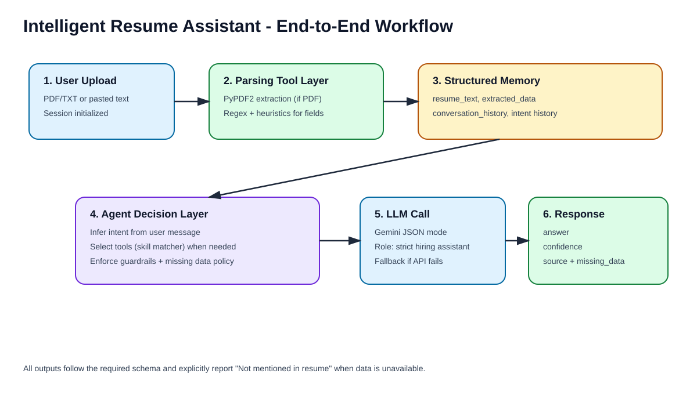
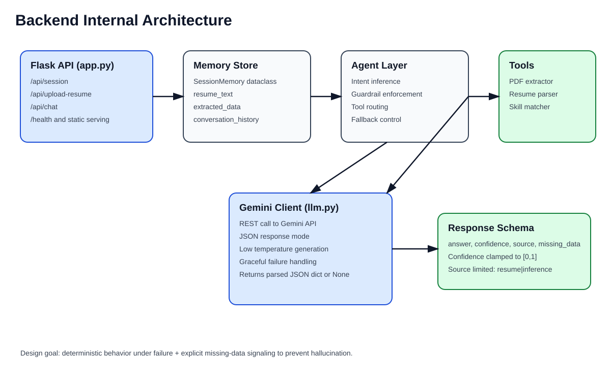
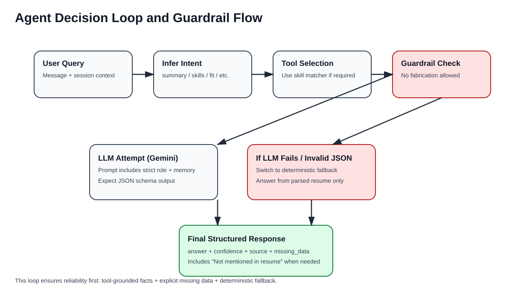

# Intelligent Resume Assistant

Agentic fullstack AI system for resume analysis and hiring-focused Q&A.

## Assignment Coverage

This project implements all core requirements from the Fullstack AI Engineer take-home:

- Resume input: PDF or text resume support
- Structured extraction: name, skills, experience, education
- Chat interface: summary, evaluation, skills, and contextual Q&A
- LLM integration: Gemini API support
- Agentic layer: role alignment, context memory, tools, guardrails
- Mandatory structured response schema

```json
{
  "answer": "...",
  "confidence": 0.0,
  "source": "resume | inference",
  "missing_data": []
}
```

## Workflow Images

### End-to-End Workflow


### Backend Architecture


### Agent Decision Loop


## Quick Start

```bash
cd backend
python -m venv .venv
```

Windows PowerShell:

```powershell
.venv\Scripts\Activate.ps1
pip install -r requirements.txt
copy .env.example .env
```

Set your key in `.env`:

```env
GEMINI_API_KEY=your_key_here
```

Run:

```bash
python app.py
```

Open:

`http://localhost:8000`

## Project Structure

```text
resume_system/
  backend/
    app.py
    agent.py
    memory.py
    tools.py
    llm.py
    models.py
  frontend/
    index.html
    styles.css
    app.js
  docs/
    TECHNICAL_GUIDE.md
    images/
      workflow-overview.svg
      backend-architecture.svg
      agent-decision-loop.svg
```

## API Summary

- `POST /api/session`: start a session, returns `session_id`
- `POST /api/upload-resume`: upload pdf/txt or send `resume_text`
- `POST /api/chat`: ask questions using stored resume context

## Reliability and Guardrails

- Strict assistant role: "hiring assistant only"
- Never fabricates unavailable details
- Explicitly returns `"Not mentioned in resume"` when data is absent
- Deterministic fallback when LLM is unavailable
- Output schema always enforced

## Detailed Documentation

For deep technical internals, design choices, tool flow, and endpoint contracts:

- [Technical Guide](docs/TECHNICAL_GUIDE.md)
